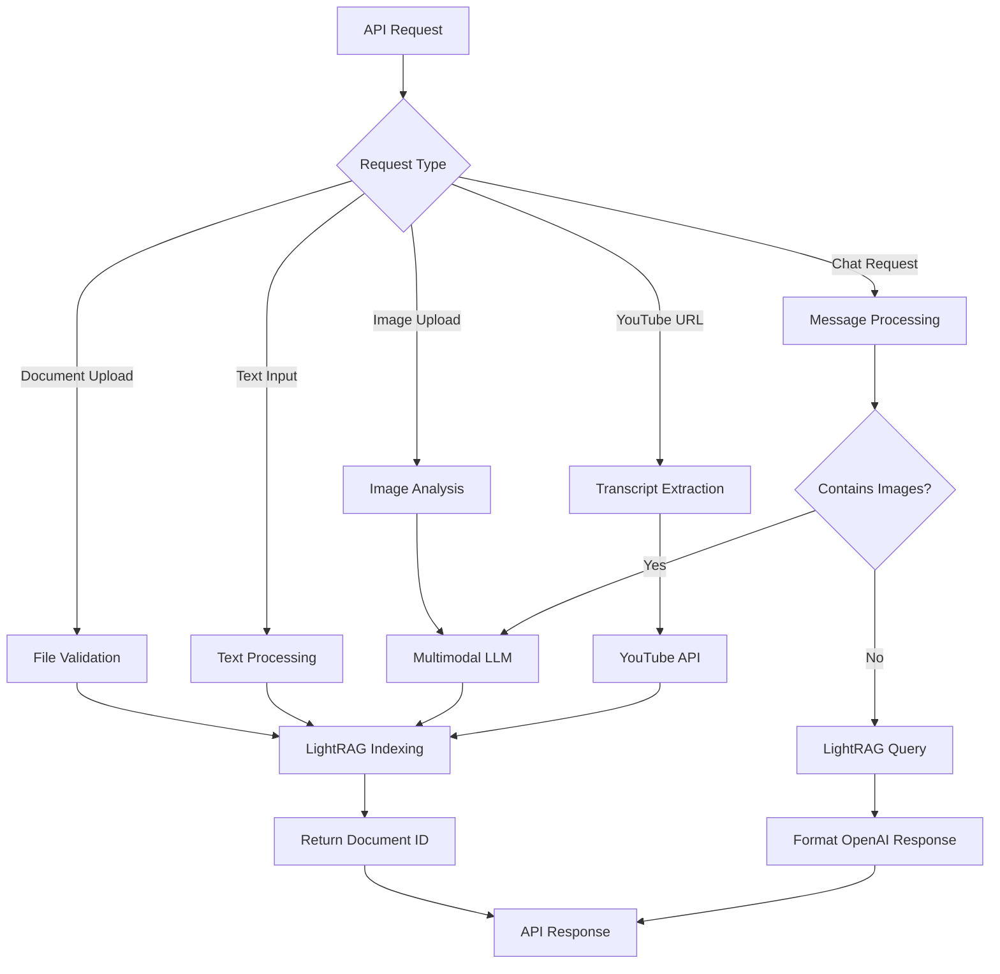

# Product Requirements Document: LightRAG Preprocessing API

**Version:** 1.0  
**Date:** December 2024  
**Project:** LightRAG Preprocessing API Gateway

---

## 1. Product Overview

A stateless preprocessing API gateway that extends LightRAG capabilities by supporting multimodal data sources (documents, images, YouTube videos) and provides a unified OpenAI-compatible chat interface. The service acts as an intelligent middleware that processes various input formats and seamlessly integrates them into the LightRAG knowledge base.

- **Core Purpose:** Centralize data preparation processes and extend LightRAG with multimodal capabilities while maintaining compatibility with existing OpenAI-based frontends.
- **Target Market:** Developers and organizations building RAG-based applications who need to process diverse data sources beyond traditional text documents.

## 2. Core Features

### 2.1 User Roles

| Role | Access Method | Core Permissions |
|------|---------------|------------------|
| API Consumer | API Key authentication | Can upload documents, process images, extract YouTube transcripts, and use chat API |
| System Administrator | Environment configuration | Can configure service settings, monitor health, and manage API keys |

### 2.2 Feature Module

Our LightRAG Preprocessing API consists of the following main functional areas:

1. **Document Processing Interface**: File upload handling, text input processing, format validation and conversion.
2. **Multimodal Processing Interface**: Image analysis with LLM description generation, YouTube transcript extraction with language preferences.
3. **Chat API Interface**: OpenAI-compatible chat endpoint with multimodal message support and LightRAG integration.
4. **Administrative Interface**: Health monitoring, configuration management, and service status reporting.

### 2.3 Page Details

| Interface Name | Module Name | Feature Description |
|----------------|-------------|---------------------|
| Document Processing | File Upload Handler | Accept multipart file uploads. Validate file types (PDF, TXT, MD, DOCX). Forward to LightRAG for indexing. Return document ID and status. |
| Document Processing | Text Input Processor | Accept JSON text input. Create temporary document structure. Send to LightRAG indexing API. Return processing status and document ID. |
| Multimodal Processing | Image Analyzer | Accept image uploads (JPG, PNG, WEBP). Generate detailed descriptions using multimodal LLM. Index descriptions in LightRAG. Return document ID and generated description. |
| Multimodal Processing | YouTube Processor | Accept YouTube URLs. Extract captions with language preference (German/English). Validate transcript availability. Index transcript in LightRAG. Return video metadata and document ID. |
| Chat API | OpenAI Compatibility Layer | Accept OpenAI chat format requests. Process multimodal messages (text + images). Convert image URLs to text descriptions. Query LightRAG with processed messages. Return OpenAI-formatted responses. |
| Administrative | Health Monitor | Provide service health status. Check external service connectivity. Report configuration status. Monitor resource usage and performance metrics. |

## 3. Core Process

### 3.1 Document Processing Flow
Users upload documents through the API, which validates the file type and size, then forwards the content to LightRAG for indexing. The system returns a unique document ID for tracking and reference.

### 3.2 Multimodal Processing Flow
For images, the system generates detailed text descriptions using a multimodal LLM, then indexes these descriptions. For YouTube videos, it extracts available transcripts with language preferences and indexes the content.

### 3.3 Chat API Flow
The chat API receives OpenAI-formatted requests, processes any embedded images by converting them to text descriptions, combines the conversation context into a search query, retrieves relevant information from LightRAG, and returns responses in OpenAI format.

## 4. User Interface Design

### 4.1 Design Style

- **Primary Colors:** Professional blue (#2563eb) for primary actions, neutral gray (#6b7280) for secondary elements
- **Response Format:** Clean JSON structure with consistent error handling and status codes
- **API Documentation:** Interactive Swagger UI with comprehensive examples and parameter descriptions
- **Error Messages:** Clear, actionable error messages with specific guidance for resolution
- **Logging Style:** Structured JSON logging with correlation IDs for request tracing

### 4.2 API Interface Design Overview

| Interface Name | Module Name | Design Elements |
|----------------|-------------|-----------------|
| Document Processing | File Upload Endpoint | RESTful design with multipart/form-data support. Clear success/error responses with document IDs. Progress indicators for large file uploads. |
| Document Processing | Text Input Endpoint | JSON request/response format. Validation feedback with specific field errors. Optional metadata fields for enhanced organization. |
| Multimodal Processing | Image Analysis Endpoint | Binary file upload with MIME type validation. Detailed description responses with confidence indicators. Error handling for unsupported formats. |
| Multimodal Processing | YouTube Processor | URL validation with immediate feedback. Language preference selection. Transcript availability status and fallback options. |
| Chat API | OpenAI Compatibility | Exact OpenAI API format compliance. Seamless integration with existing chat frontends. Multimodal message support with automatic image processing. |
| Administrative | Health Dashboard | JSON status responses with service health indicators. External dependency status monitoring. Performance metrics and resource usage reporting. |

### 4.3 API Response Consistency

All API responses follow a consistent structure with standardized error codes, human-readable messages, and machine-parseable details. The system provides comprehensive API documentation through Swagger UI for easy integration and testing.

## 5. Technical Requirements

### 5.1 Performance Requirements
- **Response Time:** Document processing under 5 seconds, image analysis under 15 seconds, YouTube processing under 30 seconds
- **Throughput:** Support for 100 concurrent requests with horizontal scaling capability
- **File Size Limits:** 50MB maximum for document uploads, 10MB for images
- **Availability:** 99.9% uptime with graceful degradation for external service failures

### 5.2 Security Requirements
- **Authentication:** API key-based authentication for all endpoints
- **Input Validation:** Strict file type and size validation with malware scanning
- **Data Protection:** No persistent storage of uploaded files, secure API key management
- **Rate Limiting:** Configurable rate limits to prevent abuse and ensure fair usage

### 5.3 Integration Requirements
- **LightRAG Compatibility:** Full integration with LightRAG indexing and query APIs
- **OpenAI Compatibility:** Complete adherence to OpenAI chat completion API format
- **External Services:** Reliable integration with multimodal LLM providers and YouTube transcript services
- **Monitoring:** Comprehensive health checks and performance monitoring capabilities

### 5.4 Scalability Requirements
- **Horizontal Scaling:** Stateless design supporting multiple instance deployment
- **Resource Management:** Configurable resource limits and timeout handling
- **Queue Support:** Optional async processing for heavy computational tasks
- **Load Balancing:** Support for load balancer health checks and traffic distribution