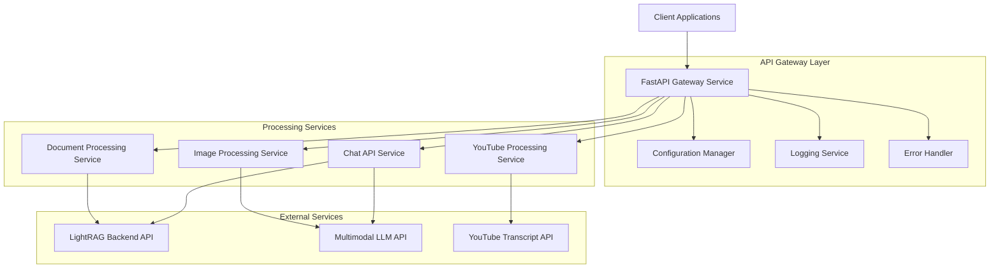
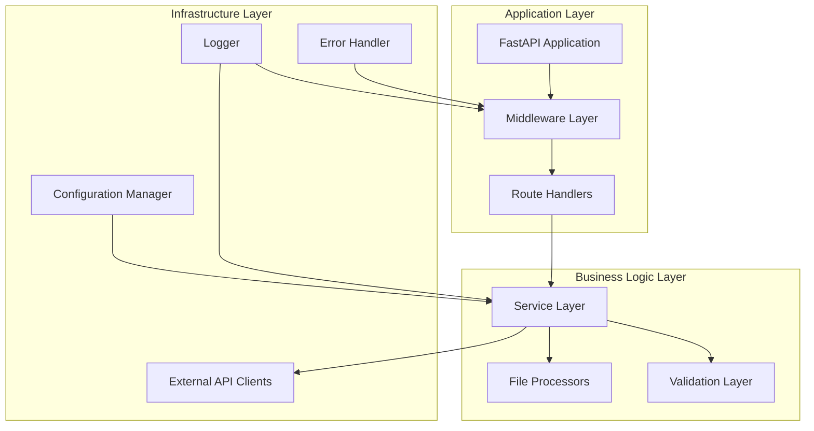
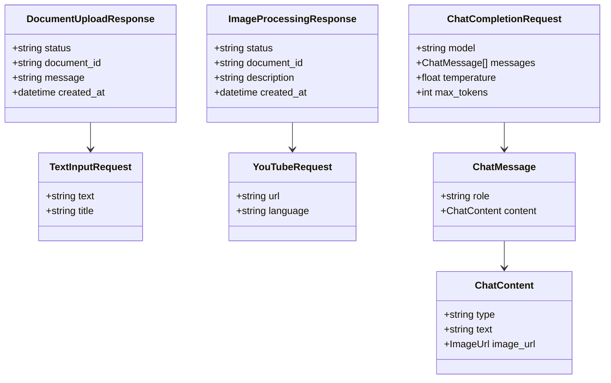

# Technical Architecture Document: LightRAG Preprocessing API

**Version:** 1.0  
**Date:** December 2024  
**Project:** LightRAG Preprocessing API

---

## 1. Architecture Design



## 2. Technology Description

- **Backend Framework:** FastAPI@0.104.1 + Uvicorn@0.24.0
- **HTTP Client:** httpx@0.25.2 for async requests
- **File Processing:** python-multipart@0.0.6, PyMuPDF@1.23.8
- **Image Processing:** Pillow@10.1.0
- **YouTube Processing:** youtube-transcript-api@0.6.1
- **Configuration:** pydantic-settings@2.1.0
- **Logging:** structlog@23.2.0
- **Validation:** pydantic@2.5.0
- **Environment:** python-dotenv@1.0.0

## 3. Route Definitions

| Route | Purpose |
|-------|---------|
| /api/documents/upload | Upload and process document files (PDF, TXT, MD, DOCX) |
| /api/documents/text | Process plain text input for indexing |
| /api/documents/image | Process image files with multimodal LLM description |
| /api/documents/youtube | Extract and process YouTube video transcripts |
| /v1/chat/completions | OpenAI-compatible chat API with multimodal support |
| /health | Health check endpoint for monitoring |
| /docs | Interactive API documentation (Swagger UI) |

## 4. API Definitions

### 4.1 Core API Endpoints

#### Document Upload
```
POST /api/documents/upload
```

Request:
| Param Name | Param Type | isRequired | Description |
|------------|------------|------------|-------------|
| file | File (multipart) | true | Document file (PDF, TXT, MD, DOCX) |

Response:
| Param Name | Param Type | Description |
|------------|------------|-------------|
| status | string | Success/error status |
| document_id | string | Unique identifier for indexed document |
| message | string | Processing result message |

Example Response:
```json
{
  "status": "success",
  "document_id": "doc_xyz123",
  "message": "Document successfully indexed"
}
```

#### Text Input
```
POST /api/documents/text
```

Request:
| Param Name | Param Type | isRequired | Description |
|------------|------------|------------|-------------|
| text | string | true | Plain text content to index |
| title | string | false | Optional title for the text document |

Response:
| Param Name | Param Type | Description |
|------------|------------|-------------|
| status | string | Success/error status |
| document_id | string | Unique identifier for indexed text |

#### Image Processing
```
POST /api/documents/image
```

Request:
| Param Name | Param Type | isRequired | Description |
|------------|------------|------------|-------------|
| image | File (multipart) | true | Image file (JPG, PNG, WEBP) |

Response:
| Param Name | Param Type | Description |
|------------|------------|-------------|
| status | string | Success/error status |
| document_id | string | Unique identifier for indexed description |
| description | string | Generated text description of the image |

#### YouTube Processing
```
POST /api/documents/youtube
```

Request:
| Param Name | Param Type | isRequired | Description |
|------------|------------|------------|-------------|
| url | string | true | YouTube video URL |
| language | string | false | Preferred language (default: de, fallback: en) |

Response:
| Param Name | Param Type | Description |
|------------|------------|-------------|
| status | string | Success/error status |
| document_id | string | Unique identifier for indexed transcript |
| video_title | string | Title of the YouTube video |
| transcript_length | integer | Length of extracted transcript |

#### OpenAI-Compatible Chat
```
POST /v1/chat/completions
```

Request (OpenAI format):
```json
{
  "model": "lightrag-proxy",
  "messages": [
    {
      "role": "user",
      "content": [
        {
          "type": "text",
          "text": "What do you see in this image?"
        },
        {
          "type": "image_url",
          "image_url": {
            "url": "data:image/jpeg;base64,..."
          }
        }
      ]
    }
  ]
}
```

Response (OpenAI format):
```json
{
  "id": "chatcmpl-xyz",
  "object": "chat.completion",
  "created": 1677652288,
  "model": "lightrag-proxy",
  "choices": [{
    "index": 0,
    "message": {
      "role": "assistant",
      "content": "Based on the indexed knowledge, I can see..."
    },
    "finish_reason": "stop"
  }]
}
```

## 5. Server Architecture Diagram



## 6. Data Model

### 6.1 Request/Response Models



### 6.2 Configuration Schema

```python
# Configuration model (no persistent database required)
class Settings:
    # LightRAG Configuration
    lightrag_base_url: str
    lightrag_api_key: str
    
    # Multimodal LLM Configuration
    openai_api_key: str
    openai_model: str = "gpt-4-vision-preview"
    
    # Application Configuration
    max_file_size: int = 50 * 1024 * 1024  # 50MB
    allowed_file_types: list = [".pdf", ".txt", ".md", ".docx"]
    allowed_image_types: list = [".jpg", ".jpeg", ".png", ".webp"]
    
    # YouTube Configuration
    youtube_languages: list = ["de", "en"]
    
    # Logging Configuration
    log_level: str = "INFO"
    log_format: str = "json"
```

## 7. Security Architecture

### 7.1 API Security
- **Authentication:** Bearer token authentication for API access
- **Rate Limiting:** Configurable rate limits per endpoint
- **Input Validation:** Strict validation using Pydantic models
- **File Upload Security:** File type validation, size limits, virus scanning
- **CORS Configuration:** Configurable CORS policies

### 7.2 Data Protection
- **API Key Management:** Environment-based configuration
- **Secure Headers:** Security headers middleware
- **Request Logging:** Sanitized logging (no sensitive data)
- **Error Handling:** Generic error messages to prevent information leakage

## 8. Configuration Management

### 8.1 Environment Variables
```bash
# LightRAG Configuration
LIGHTRAG_BASE_URL=http://localhost:8000
LIGHTRAG_API_KEY=your_lightrag_api_key

# OpenAI Configuration
OPENAI_API_KEY=your_openai_api_key
OPENAI_MODEL=gpt-4-vision-preview

# Application Configuration
MAX_FILE_SIZE=52428800
LOG_LEVEL=INFO
CORS_ORIGINS=["http://localhost:3000"]

# Security
API_KEY=your_api_key
RATE_LIMIT_PER_MINUTE=60
```

### 8.2 Configuration Validation
- Pydantic-based configuration validation
- Environment-specific configuration files
- Configuration health checks on startup
- Graceful degradation for optional services

## 9. Error Handling & Logging

### 9.1 Error Response Format
```json
{
  "error": {
    "code": "INVALID_FILE_TYPE",
    "message": "Unsupported file type. Allowed types: .pdf, .txt, .md, .docx",
    "details": {
      "received_type": ".xlsx",
      "allowed_types": [".pdf", ".txt", ".md", ".docx"]
    }
  },
  "request_id": "req_abc123",
  "timestamp": "2024-12-19T10:30:00Z"
}
```

### 9.2 Logging Strategy
- Structured logging with correlation IDs
- Different log levels for different environments
- Request/response logging with sanitization
- Performance metrics logging
- External service call logging

## 10. Performance & Scalability

### 10.1 Performance Optimizations
- **Async Processing:** FastAPI with async/await for I/O operations
- **Connection Pooling:** HTTP client connection pooling
- **File Streaming:** Streaming file uploads for large files
- **Caching:** Response caching for frequently accessed data
- **Compression:** Response compression for large payloads

### 10.2 Scalability Considerations
- **Horizontal Scaling:** Stateless design for easy horizontal scaling
- **Load Balancing:** Support for multiple instance deployment
- **Resource Limits:** Configurable resource limits and timeouts
- **Queue Integration:** Optional async task queue for heavy processing
- **Health Checks:** Comprehensive health check endpoints

## 11. Deployment Architecture

### 11.1 Container Deployment
```dockerfile
# Multi-stage Docker build
FROM python:3.11-slim as base
FROM base as dependencies
FROM dependencies as application
```

### 11.2 Infrastructure Requirements
- **Compute:** 2 CPU cores, 4GB RAM minimum
- **Storage:** Temporary file storage for processing
- **Network:** Outbound HTTPS access to external APIs
- **Monitoring:** Health check endpoints for load balancers
- **Logging:** Centralized logging infrastructure

## 12. Integration Patterns

### 12.1 LightRAG Integration
- RESTful API integration with retry logic
- Configurable timeout and retry policies
- Health check integration
- Error mapping and handling

### 12.2 External Service Integration
- **OpenAI API:** Multimodal LLM integration with fallback models
- **YouTube API:** Transcript extraction with language preferences
- **Circuit Breaker:** Protection against external service failures
- **Monitoring:** External service health monitoring

## 13. Monitoring & Observability

### 13.1 Metrics Collection
- Request/response metrics
- External service call metrics
- File processing metrics
- Error rate monitoring

### 13.2 Health Checks
- Application health endpoint
- External service dependency checks
- Resource utilization monitoring
- Configuration validation checks